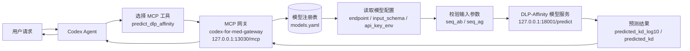
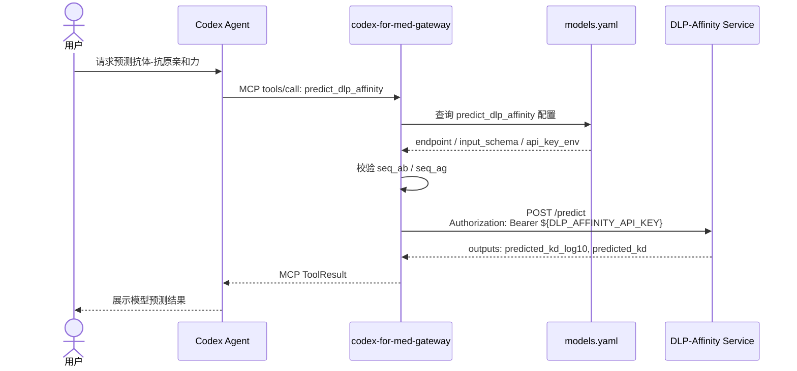
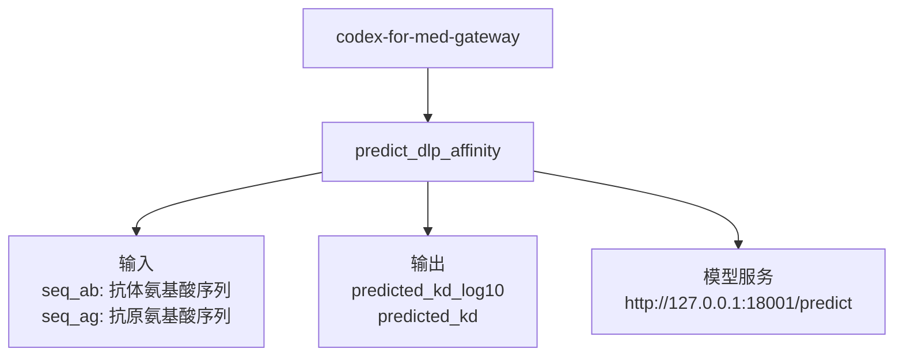
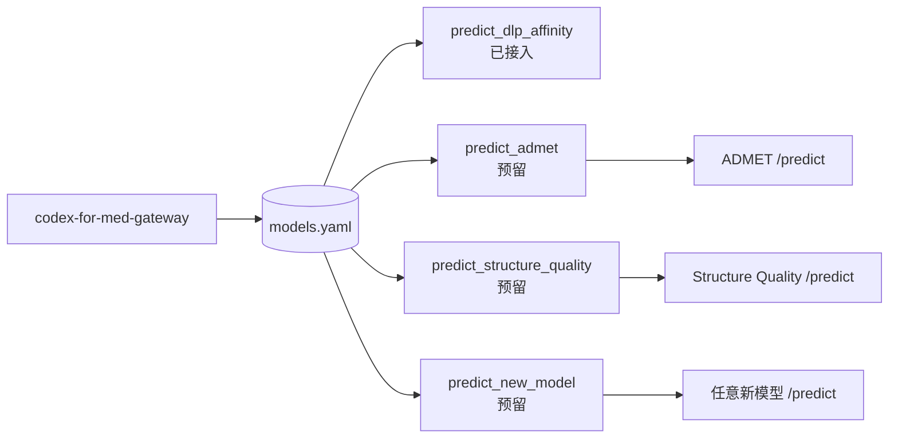

# Codex 调用网关模型流程

## 总体链路



Codex 不直接调用模型服务，而是先调用 MCP 工具。网关根据 `models.yaml` 找到对应模型配置，校验输入后转发到模型 HTTP `/predict` 接口，再把模型返回结果传回 Codex。

## 请求时序



## 当前已接入模型



当前网关注册的工具是 `predict_dlp_affinity`。它用于 DLP-Affinity 抗体-抗原亲和力预测。

## 后续模型接入口



后续接入新模型时，只需要在 `models.yaml` 新增一个 tool block，并让新模型服务实现统一的 `POST /predict` HTTP 接口。网关会把每个 `models.yaml` 里的模型条目注册成一个 Codex 可调用的 MCP 工具。

统一模型服务接口：

```http
POST /predict
Authorization: Bearer <model-api-key>
Content-Type: application/json

{
  "inputs": {
    "...": "..."
  }
}
```

推荐返回：

```json
{
  "outputs": {
    "...": "..."
  },
  "metadata": {
    "model_version": "optional",
    "latency_ms": 123
  }
}
```
